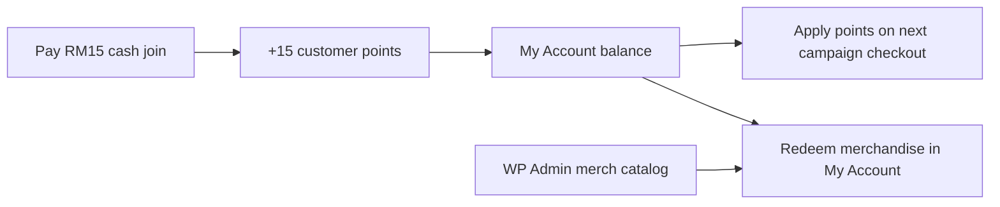

# Customer Points & Redeem Implementation Plan

> **For agentic workers:** REQUIRED SUB-SKILL: Use superpowers:subagent-driven-development (recommended) or superpowers:executing-plans to implement this plan task-by-task. Steps use checkbox (`- [ ]`) syntax for tracking.

**Goal:** Customer/participant points only — earn on cash-paid joins, spend as checkout credit toward the next campaign, or redeem admin merchandise visible only in My Account.

**Architecture:** Extend existing `CW_Points` ledger in the WordPress plugin. No business sponsorship points and no organizer coupon-minting from points. Points convert at **100 pts = RM1.00** (so **15 pts = RM0.15**). Merchandise is an admin catalog; contestants redeem only from the dashboard.

**Tech Stack:** WordPress plugin `creativewings-yibon`, WooCommerce checkout, My Account contestant dashboard, optional later port to New_Creativewings.

## Global Constraints

- **Audience:** participants/customers only — **no** business/sponsor points system
- **Earn:** cash paid only → `floor(cash_paid_rm)` points (RM15 → **15 pts**)
- **Value:** **10 pts = RM0.10** → **100 pts = RM1.00** → **15 pts = RM0.15**
- **Spend v1:** (1) apply points at checkout as entry-fee credit, (2) redeem merchandise
- **Merchandise:** admin CRUD in WP admin; **visible only** in My Account (not public shop/pages)
- **Out of scope v1:** business points, sponsor coupon minting from points, cash-out to bank/wallet withdrawal (points stay as campaign credit or merch)
- **Ship WP first;** NCW port is a follow-up, not blocking

---

## Confirmed product rules

| Rule | Value |
|------|--------|
| Who earns | Customer / contestant only |
| Join RM15 cash | **+15 points** |
| Free / 100% coupon join | **0 points** |
| Point value | **15 pts ≈ RM0.15** (1 pt = RM0.01) |
| Use points at next join | Checkout applies points as discount (e.g. 1500 pts ≈ RM15 full fee) |
| Merchandise | Admin adds items; customer redeems in **My Account → Points** only |
| Business / sponsor points | **Removed from this plan** (school sponsor coupons stay as today, unrelated) |

---

## Current state

- Earn ledger already exists: [`includes/class-cw-points.php`](../../includes/class-cw-points.php) (`cw_points_ledger`, balance meta, 12-month expiry, leaderboard)
- Dashboard Points tab exists but redeem is **“Coming Soon”**: [`includes/dashboard/class-cw-dashboard-contestant.php`](../../includes/dashboard/class-cw-dashboard-contestant.php) `render_points()`
- School sponsor coupons remain unchanged: [`includes/class-cw-sponsor-coupons.php`](../../includes/class-cw-sponsor-coupons.php) — **not** part of this points product
- **No** merchandise catalog yet

---

## File map

| File | Responsibility |
|------|----------------|
| `includes/class-cw-points.php` | Earn (cash-only), spend for checkout + merch, balance checks |
| `includes/class-cw-points-rewards.php` *(new)* | Merch catalog CRUD helpers + redemption records |
| `includes/admin/class-cw-points-rewards-admin.php` *(new)* | Admin merchandise UI |
| `includes/class-cw-points-checkout.php` *(new)* | Apply points as WC discount / fee credit at checkout |
| `includes/dashboard/class-cw-dashboard-contestant.php` | Replace Coming Soon with merch list + redeem + points-to-checkout CTA |
| `includes/class-cw-loader.php` / `creativewings-core.php` | Bootstrap + version bump |
| `assets/css/…` | Light dashboard merch card styles if needed |

---

## Task 1: Confirm earn = cash paid only

**Files:** `includes/class-cw-points.php`

- [ ] Audit `on_entry_created_from_order` / earn path — award `floor(cash_paid)` per qualifying order, **skip** when paid total is 0 or full sponsor coupon
- [ ] Write/adjust a focused test or manual checklist: RM15 paid → +15; free join → 0
- [ ] Commit: `fix(points): award only on cash paid joins`

## Task 2: Merchandise data model + admin CRUD

**Files:** `includes/class-cw-points-rewards.php`, `includes/admin/class-cw-points-rewards-admin.php`

- [ ] Options/table for rewards: `title`, `description`, `image_id`, `points_cost`, `stock` (null = unlimited), `is_active`, `sort_order`
- [ ] Redemptions log: `user_id`, `reward_id`, `points_spent`, `status` (`pending`/`fulfilled`/`cancelled`), `created_at`
- [ ] Admin page under Creative Wings / Tools: add/edit/activate merch; mark redemptions fulfilled
- [ ] **Do not** register public product/shortcode for merch
- [ ] Commit: `feat(points): admin merchandise catalog`

## Task 3: My Account redeem UI (merchandise only surface)

**Files:** `includes/dashboard/class-cw-dashboard-contestant.php`

- [ ] Replace “Coming Soon” with:
  - Balance + expiry reminder
  - Active merch cards (image, cost, stock, Redeem button)
  - Redemption history
  - Short note: “Use points at checkout when joining a campaign”
- [ ] Redeem action: verify balance + stock → debit ledger `redeem_merch` → create redemption `pending`
- [ ] Commit: `feat(points): my-account merchandise redeem`

## Task 4: Apply points at campaign checkout

**Files:** `includes/class-cw-points-checkout.php`, checkout hooks

- [ ] On campaign checkout (logged-in customer): UI to apply N points (max = balance, and not more than order cash due × 100)
- [ ] Conversion: `rm_credit = points / 100` (15 pts → RM0.15)
- [ ] On successful paid/partially-paid order: debit `spend_checkout` and store order meta `_cw_points_spent`
- [ ] If order fails/cancelled before complete: do not debit (or refund points on cancel — pick one and document; prefer debit only on payment complete)
- [ ] Manual test: balance 15 → apply 15 → RM0.15 off RM15 fee → pay RM14.85 → remaining points 0
- [ ] Commit: `feat(points): spend points as checkout credit`

## Task 5: Settings + version

- [ ] Settings (optional simple constants first): earn 1:1 cash, redeem 100 pts = RM1, min checkout spend (e.g. 10 pts), merch min cost
- [ ] Bump plugin to `11.1.0` (feature)
- [ ] Smoke-test My Account Points + one campaign checkout
- [ ] Commit: `chore: bump to 11.1.0 customer points redeem`

## Task 6 (optional follow-up): NCW port

- [ ] Supabase: `customer_points_ledger`, `points_rewards`, `points_redemptions`
- [ ] Dashboard redeem + checkout points application
- [ ] Update NCW migration checklist  
**Not required to ship WP v1.**

---

## Worked examples

### Earn
| Action | Points |
|--------|--------|
| Pay RM15 entry (cash) | **+15** |
| Join with 100% school sponsor coupon | **+0** |

### Spend at next campaign
| Balance | Apply | RM credit | Fee RM15 left to pay |
|---------|-------|-----------|----------------------|
| 15 | 15 | RM0.15 | RM14.85 |
| 1500 | 1500 | RM15.00 | RM0.00 |

### Merchandise
| Item | Cost | Where shown |
|------|------|-------------|
| Sticker pack | 200 pts | My Account → Points only |
| T-shirt | 1500 pts | My Account → Points only |

---

## Explicitly removed vs old “Dual Points” plan

- ❌ Admin grant of business sponsorship points  
- ❌ Organizer minting sponsor coupons from points  
- ❌ Business points ledger / dashboard  
- ❌ Partner pilot “business grant → coupons”  
- ❌ Cash-out to MYR wallet / bank (unless requested later)

School sponsor coupons (Angel codes) stay as today’s product — separate from customer points.

---

## Rollout

1. Task 1 earn fix  
2. Tasks 2–3 merch admin + My Account  
3. Task 4 checkout spend  
4. Task 5 ship `11.1.0`  
5. Optional NCW port  

## Pilot checklist

- [ ] One customer pays RM15 → sees +15 points in My Account  
- [ ] Admin creates one merch item → visible only in My Account  
- [ ] Customer redeems merch → balance drops; admin sees pending redemption  
- [ ] Customer applies points on next join → fee reduced by pts/100  
- [ ] Business dashboard shows **no** new sponsorship-points UI  
